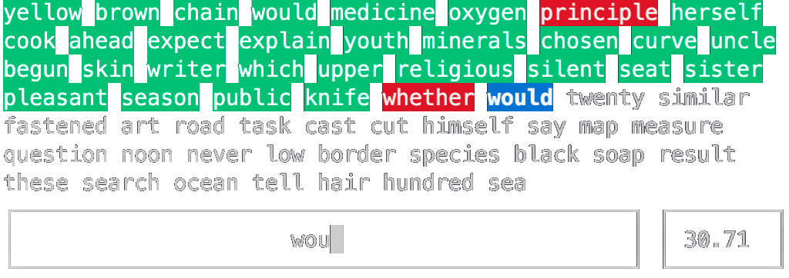
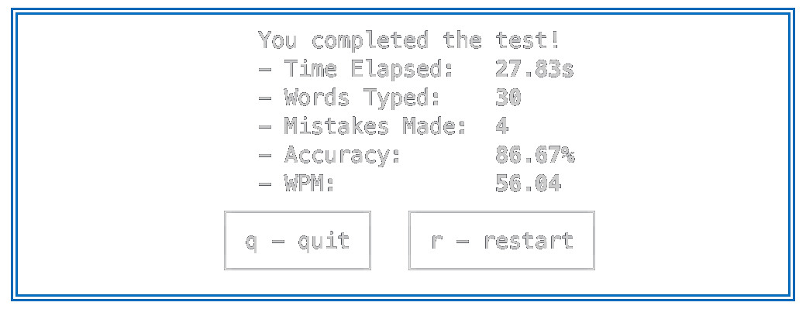

# TERMINAL TYPIST

Test your typing speed right from your terminal





## Usage

### Run Without Installing

```zsh
npx terminal-typist
```

### Install

```zsh
yarn global add terminal-typist
```

or

```zsh
npm install -g terminal-typist
```

Then run it with the command `tertyp`

```zsh
tertyp
```

## Parameters

| Flag                | Description                                    |
| ------------------- | ---------------------------------------------- |
| `-w`, `--words`     | The number of words in the typing test         |
| `-m`, `--maxLength` | The maximum length of words in the typing test |
